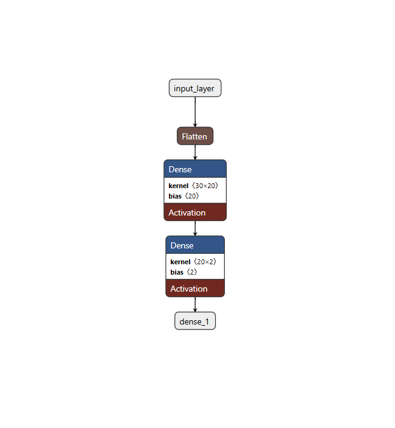

<body>

<h1>Cancer Detection Model</h1>

A machine learning model designed to assist in the early detection of cancer, using both a traditional logistic regression model and a more advanced neural network. This project covers the end-to-end pipeline, from data preprocessing to model evaluation, with flexibility to run on Google Colab or a local environment.

<h2>Table of Contents</h2>
<ol>
  <li><a href="#project-overview">Project Overview</a></li>
  <li><a href="#dataset">Dataset</a></li>
  <li><a href="#installation-and-setup">Installation and Setup</a></li>
  <li><a href="#methodology">Methodology</a></li>
  <ul>
    <li><a href="#data-preprocessing">Data Preprocessing</a></li>
    <li><a href="#feature-selection">Feature Selection</a></li>
    <li><a href="#logistic-regression">Logistic Regression</a></li>
    <li><a href="#neural-network">Neural Network</a></li>
    <li><a href="#evaluation-metrics">Evaluation Metrics</a></li>
  </ul>
  <li><a href="#running-the-project">Running the Project</a></li>
  <li><a href="#project-structure">Project Structure</a></li>
  <li><a href="#future-directions">Future Directions</a></li>
  <li><a href="#references">References</a></li>
</ol>

<h2 id="project-overview">Project Overview</h2>

This project aims to build efficient and accurate models for cancer detection based on a structured dataset. It includes two approaches:
  <ul>
    <li><strong>Logistic Regression:</strong> A traditional machine learning model used as a baseline for the task.</li>
    <li><strong>Neural Network:</strong> A more advanced deep learning approach using a neural network to predict cancer malignancy.</li>
  </ul>
Both approaches are designed to identify patterns associated with cancer diagnoses and can serve as a foundation for future work on similar medical diagnostic applications.

##Neural Network Architecture
The deep learning approach leverages a neural network for cancer detection. Below is the architecture of the neural network used for training the model.

The neural network consists of several layers:
- **Input Layer**: Accepts features from the dataset.
- **Hidden Layer**: Dense layer for feature extraction and learning complex patterns.
- **Output Layer**: Produces the final prediction (Cancerous Tumour or Non-Cancerous Tumour).
<h2 id="dataset">Dataset</h2>

The dataset for this project is available as <code>data.csv</code>. It includes a range of features commonly associated with cancer diagnoses. Make sure to download this file from the repository or use the link provided below to get a copy if you're running the project locally.

<h3>Data Source</h3>
<ul>
  <li><strong>File:</strong> <code>data.csv</code></li>
  <li><strong>Format:</strong> CSV</li>
  <li><strong>Attributes:</strong> (list any key features, if known)</li>
</ul>

<strong>Note:</strong> For users on Google Colab, the dataset is automatically loaded from the repository. For local setup, see the installation instructions below.

<h2 id="installation-and-setup">Installation and Setup</h2>

<h3>Running on Google Colab</h3>
<ol>
  <li>Open the  provided in the repository.</li>
  <li>Mount Google Drive if needed and upload <code>data.csv</code>.</li>
  <li>Run the cells sequentially to execute the full pipeline for both models.</li>
</ol>

<h3>Running Locally</h3>
<ol>
  <li>Clone the repository:
    <pre><code>git clone https://github.com/your-username/cancer-detection.git</code></pre>
  </li>
  <li>Navigate to the project directory:
    <pre><code>cd cancer-detection</code></pre>
  </li>
  <li>Install required dependencies:
    <pre><code>pip install -r requirements.txt</code></pre>
  </li>
  <li>Download the dataset as <code>data.csv</code> and place it in the root directory of the project.</li>
  <li>Run the main notebook or script:
    <pre><code>jupyter notebook cancer_detection.ipynb</code></pre>
    or
    <pre><code>python cancer_detection.py</code></pre>
  </li>
</ol>

<h2 id="methodology">Methodology</h2>

<h3 id="data-preprocessing">Data Preprocessing</h3>

Proper data preprocessing is essential for effective model training. The steps taken include:

<ul>
  <li><strong>Data Cleaning:</strong> Handling missing values, removing duplicate entries, and ensuring data consistency.</li>
  <li><strong>Normalization:</strong> Scaling features to a standard range for improved model convergence.</li>
</ul>

<h3 id="feature-selection">Feature Selection</h3>

Feature selection improves model accuracy and reduces overfitting by using only the most significant predictors.

<ul>
  <li><strong>Correlation Analysis:</strong> Selected features based on correlation to remove multicollinearity.</li>
  <li><strong>Dimensionality Reduction:</strong> Reduced the dataset’s dimensionality to improve computational efficiency.</li>
</ul>

<h3 id="logistic-regression">Logistic Regression</h3>

The logistic regression model is implemented as a baseline model for cancer detection. It is a traditional machine learning method that works well for binary classification tasks, where the outcome is either malignant or benign.

<ul>
  <li><strong>Model:</strong> Logistic Regression is used to identify patterns and predict the likelihood of cancer malignancy.</li>
  <li><strong>Training:</strong> The model is trained on the preprocessed data using standard optimization techniques.</li>
</ul>

<h3 id="neural-network">Neural Network</h3>

The neural network implementation is a more advanced approach using TensorFlow/Keras. It offers the flexibility to handle complex relationships in the data and can outperform traditional models in certain scenarios.

<ul>
  <li><strong>Model:</strong> A simple neural network with one hidden layer is implemented using Keras.</li>
  <li><strong>Activation Function:</strong> ReLU is used in the hidden layer, and a sigmoid activation is used for the output layer.</li>
  <li><strong>Training:</strong> The model is trained on standardized data, using an optimizer like Adam and loss function as binary cross-entropy.</li>
</ul>

<h3 id="evaluation-metrics">Evaluation Metrics</h3>

We used the following metrics to evaluate model performance:

<ul>
  <li><strong>Accuracy:</strong> Measures overall correct predictions.</li>
  <li><strong>Precision, Recall, and F1-Score:</strong> Essential for handling class imbalance and understanding true/false positive rates.</li>
  <li><strong>ROC-AUC Score:</strong> Assesses model performance across all classification thresholds.</li>
</ul>

<h2 id="running-the-project">Running the Project</h2>

This project can be run in two main environments:

<ol>
  <li><strong>Google Colab:</strong> Open the notebook in Colab, upload <code>data.csv</code> and run the cells.</li>
  <li><strong>Local Setup:</strong> Clone the repo, install dependencies, and execute the notebook or script.</li>
</ol>

<h3>Example Usage</h3>
<pre><code>from cancer_detection import CancerDetection

# Initialize and run model training for both Logistic Regression and Neural Network
logistic_model = CancerDetection(model_type='logistic_regression')
logistic_model.train_and_evaluate()

neural_network_model = CancerDetection(model_type='neural_network')
neural_network_model.train_and_evaluate()</code></pre>

<h2 id="project-structure">Project Structure</h2>

<pre><code>cancer-detection/
│
├── data/                        # Data files (data.csv)
├── notebooks/                   # Jupyter notebooks for experimentation and model development
│   ├── cancer_detection.ipynb   # Main notebook file
│
├── scripts/                     # Python scripts for modularity
│   ├── preprocess.py            # Preprocessing functions
│   ├── model_training.py        # Model training functions
│   ├── logistic_regression.py   # Logistic regression model code
│   ├── neural_network.py        # Neural network model code
│
├── README.md                    # Project README
├── requirements.txt             # Python dependencies
└── LICENSE                      # License for the project
</code></pre>

<h2 id="future-directions">Future Directions</h2>

This project provides a foundational model for cancer detection, but several potential enhancements are possible:

<ul>
  <li><strong>Integrate Deep Learning Models:</strong> Experiment with more complex deep learning models such as Convolutional Neural Networks (CNNs) for image-based cancer datasets.</li>
  <li><strong>Add Cross-Validation:</strong> Further ensure model robustness by adding cross-validation techniques.</li>
  <li><strong>Explore Transfer Learning:</strong> Use pre-trained models for cancer detection with more advanced techniques.</li>
  <li><strong>Incorporate Real-World Testing:</strong> Test with a larger, more diverse dataset to improve generalizability.</li>
</ul>

</body>
